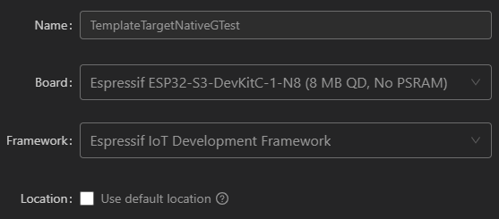
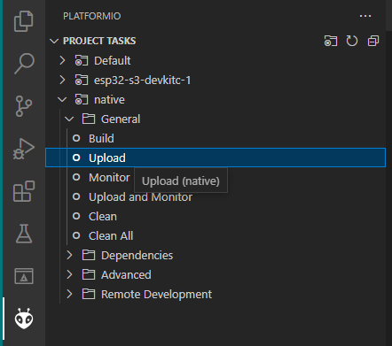

# 🧪 GTest native + ESP-IDF target using C++20
Template for setting up VS Code Platformio with ESP-IDF 5.0 for ESP32-S3 target and Google Test native for speed up development. Are you fed up with waiting for completion of building-uploading time consumming process in embedded developments 🙄 You have some platform independent code which could be tested? Here's sometihng for you! 🥳

## 🔥 Just use the template  
Siple way to setup environment. You can always change target MCU by modyfying [platformio.ini](platformio.ini) file. For example to target ESP32-C3 change env to:
```ini
[env:esp32-c3-devkitm-1]
platform = espressif32
board = esp32-c3-devkitm-1
```
Note that it will create second sdkconfig file in root/topmost folder.

### 1. Clone repository
Clone this repo and open in VS Code
```bash
git clone https://github.com/Gieneq/TemplateTargetNativeGTest.git
cd TemplateTargetNativeGTest
```
### 2. Ensure git path
If for any reason environmental variable is not proper, add in topmost [CMakeLists.txt](CMakeLists.txt):
```CMake
cmake_minimum_required(VERSION 3.16.0)
set(GIT_EXECUTABLE C:/.../Git/bin)
```
Git is required to download any dependencies.

## 3. Build and upload
Thats it!

## 🤔 Setup from scratch 
Assuming you will develop custom components to be tested.

### 1. Create project
Create project in Platformio with ESP-IDF framework and select path to workspace folder - avoid path with whitespaces.

<p alight="center">
    
</p>

### 2. Ensure git path
If for any reason environmental variable is not proper, add in topmost [CMakeLists.txt](CMakeLists.txt):
```CMake
cmake_minimum_required(VERSION 3.16.0)
set(GIT_EXECUTABLE C:/.../Git/bin)
```
Git is required to download any dependencies.

### 3. Add target and native in platformio.ini
Add taget ESP32 MCU and native. Native should be places last - it will prevent any Intelisense errors.

```ini
[env:esp32-s3-devkitc-1]
platform = espressif32
board = esp32-s3-devkitc-1
framework = espidf
monitor_speed = 115200
build_type = release
build_flags =
  -std=c++20

[env:native]
platform = native
build_type = test
build_flags =
  -std=c++20
lib_deps =
  googletest@1.12.1
```

Adding lib_deps (dependency) will trigger downloading Google Test framework on first build. Files will be placed in .pio/libdeps/native/googletest folder. So if you will removing build files to force refreshing dependencies, delete only .pio/build subfolder.

It would be more convenient to trigger unit testing before building final code, so you can build and run native using Platformio sidebar.

### 4. Add test code
Place test entrance and additional source files in [test](test) folder. Test main() should looks like this:
```cpp
#include "gtest/gtest.h"
#include "test_main.h"

TEST(DummyTest, ShouldPass)
{
    EXPECT_EQ(1, 1);
}

int main(int argc, char **argv) {
    if (RUN_ALL_TESTS())
    ;

    /* Any test functions from external files */
    //do_tests(argc, argv);

    return 0;
}
```

Inside [test_main.h](test/test_main.h) add functions prototypes to be linked with sources:
```cpp
int do_animations_tests(int argc, char **argv);
```

### 5. Add custom components
Create folder components in root/topmost folder of the project and place custom components. The components should have CMakeLists.txt to include sources, headers and connect with other components using REQUIRES:
```cpp
set(srcs 
"src/Device.cpp"
"src/DeviceHAL.cpp")

idf_component_register(SRCS "${srcs}"
                       INCLUDE_DIRS "include"
                       REQUIRES driver animations)
```
Note that in ESP-IDF 5.0+ peripherals requires passing "driver" in required dependencies.

Additional idf_component.yml file is used to define attibutes of custom component and add dependencies from official Espressif repo:
```yml
dependencies:
  idf:
    version: '>=5.0'
  espressif/led_strip: "^2.0.0"
description: Main device
version: 0.0.0
```
For example above component requires ESP-IDF of minimal version 5.0 and led_strip component from [https://components.espressif.com](https://components.espressif.com/components/espressif/led_strip).

Add path to components in [platformio.ini](platformio.ini) file:
build_flags =
  -std=c++20
    -I./components/animations/include
lib_deps =
  googletest@1.12.1
  ./components/animations

Note that those components should not be dependant on ESP-IDF!

### 6. Build
Build project using bottom platformio icon or sidebar native:

<p alight="center">
    
</p>

Note that inside .pio there will be created some new folders:
- libdeps/native with:
  + googletest,
  + any custom components,
- build/native.

After "uploading" which means running on host machine you will be notified about testing process:
```txt
[----------] Global test environment tear-down
[==========] 5 tests from 3 test suites ran. (0 ms total)
[  PASSED  ] 5 tests.
```

### 7. Add target code
Inside [src](src) folder rename main.c to main.cpp, add extern "C" around main function and create rest of app. For example:
```cpp
extern "C" {
#include "freertos/FreeRTOS.h"
#include "freertos/task.h"
#include "esp_timer.h"
}

#include "Device.h"

Device device;

extern "C" {
    void app_main() {
        device.init();
        float dt{0};

        auto current_micros = esp_timer_get_time();
        auto last_micros = current_micros - 1;


        while (1) {
            current_micros = esp_timer_get_time();
            dt = static_cast<float>(current_micros - last_micros)/1000.0F;
            last_micros = current_micros;
            device.tick(dt);
            vTaskDelay(1);
        }
    }
}
```
Inside CMakeLists.txt add all required components:
```CMake
idf_component_register(SRCS ${app_sources} 
                       INCLUDE_DIRS "."
                       REQUIRES device_core)
```

### 8. Build all and upload
Building for the first time for target ESP-IDF will take some time. If succeeded you will get:
```txt
Environment         Status    Duration
------------------  --------  ------------
esp32-s3-devkitc-1  SUCCESS   00:02:02.333
native              SUCCESS   00:00:22.551
```
Note that there will be created: 
- dependencies.lock
- sdkconfig.esp32-s3-devkitc-1

Now upload to target and observer results.

## References
- [IDF components manager](https://docs.espressif.com/projects/esp-idf/en/latest/esp32/api-guides/tools/idf-component-manager.html)
- [Components registry](https://components.espressif.com/)
- [Project structure](https://docs.platformio.org/en/stable/advanced/unit-testing/structure/hierarchy.html)
- [Build system](https://docs.espressif.com/projects/esp-idf/en/latest/esp32/api-guides/build-system.html) 
- [Adding sources in platformio.ini](https://community.platformio.org/t/how-to-add-source-directories-and-include-directories-for-libraries/21101)
- [Stackoverflow - creating custom components](https://stackoverflow.com/questions/70011677/cmake-and-esp-idf-creating-custom-components)

